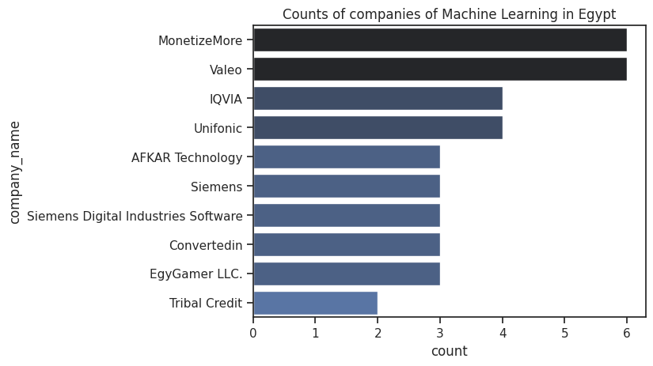
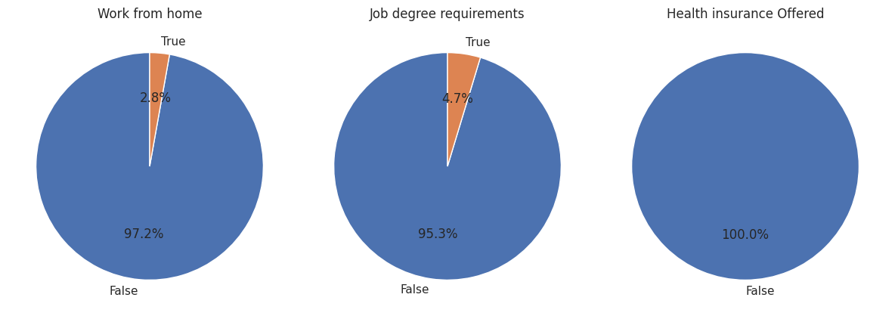
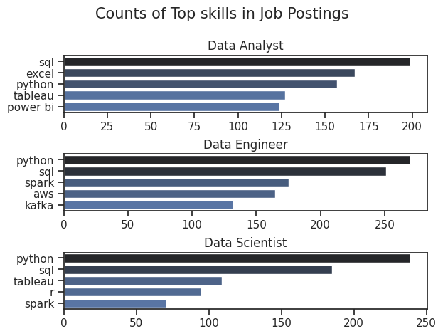
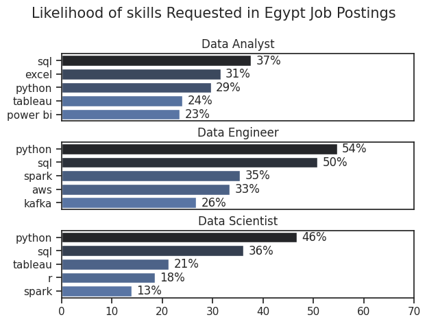

# Machine Learning Job Market Analysis in Egypt with Skill Demand Insights

I am thrilled to share my comprehensive analysis of the Machine Learning (ML) job market in Egypt, a project fueled by my passion for uncovering opportunities in this exciting field. Using data sourced from Luke Barousse's huggingface job data, I explored key aspects of ML roles in Egypt, including job locations, leading employers, typical benefits, and the most in-demand skills for top data roles. Through Python scripting and advanced data visualization, I aim to provide actionable insights for professionals looking to navigate this dynamic market.

## Objectives of the Analysis

This study addresses the following key questions:
1. What are the most prominent job locations for Machine Learning roles in Egypt?
2. Which companies are the leading employers of ML talent in Egypt?
3. What are the typical job benefits, including work-from-home options, degree requirements, and health insurance, for ML roles in Egypt?
4. What are the most in-demand skills for the top 3 data roles in Egypt, and how likely are they to be requested in job postings?

## Tools Utilized

To conduct this in-depth analysis, I leveraged the following professional tools:
- **Python:** The core language for data analysis and visualization, supported by:
  - **Pandas Library:** Facilitated efficient data manipulation and cleaning.
  - **Matplotlib Library:** Enabled the creation of foundational charts.
  - **Seaborn Library:** Enhanced visualizations with sophisticated plotting techniques.
  - **NumPy Library:** Supported numerical operations and data processing.
- **Jupyter Notebooks:** Provided an integrated environment for executing code and documenting findings.
- **Visual Studio Code:** Served as the primary platform for script development and debugging.
- **Git & GitHub:** Ensured robust version control and enabled collaboration through project sharing.

## Data Preparation and Cleanup

To ensure the reliability of my analysis, I followed a structured approach to prepare the dataset.

### Importing and Cleaning the Data

I began by importing essential libraries and performing initial data cleanup:
```python
# Importing Libraries
import seaborn as sns
import matplotlib.pyplot as plt
import pandas as pd
import numpy as np
from datasets import load_dataset
import ast

# Loading Data
dataset = load_dataset('lukebarousse/data_jobs')
df = dataset['train'].to_pandas()

# Data Cleanup
df['job_posted_date'] = pd.to_datetime(df['job_posted_date'])
df['job_skills'] = df['job_skills'].apply(lambda x: ast.literal_eval(x) if pd.notna(x) else x)
```

### Filtering for Egypt-Specific Data

To focus on Egypt, I filtered the dataset to include only jobs within the country, with a further subset for Machine Learning Engineer roles:
```python
# General Egypt Filter
df_EGY = df[df['job_country'] == 'Egypt']

# Specific Filter for Machine Learning Roles
df_ML_EGY = df[(df['job_country'] == 'Egypt') & (df['job_title_short'] == 'Machine Learning Engineer')]
```

## Key Findings

This analysis is organized into sections, each addressing a specific aspect of the ML job market in Egypt, with supporting visualizations and skill demand insights.

### 1. Prominent Job Locations for Machine Learning Roles in Egypt

I analyzed the distribution of ML job postings by location and visualized the top 10 locations using a bar chart:
#### Visualization
```python
df_plot = df_ML_EGY['job_location'].value_counts().head(10).to_frame()
sns.set_theme(style='ticks')
sns.despine()
plt.title('Counts of job locations for Machine Learning roles in Egypt')
plt.ylabel('')
sns.barplot(data=df_plot, x='count', y='job_location', hue='count', palette='dark:b_r', legend=False)
plt.show()
```

#### Results
.head(10).to_frame()
sns.set_theme(style='ticks')
sns.despine()
plt.title('Counts of companies of Machine Learning in Egypt')
plt.ylabel('')
sns.barplot(data=df_plot, x='count', y='company_name', hue='count', palette='dark:b_r', legend=False)
plt.show()
```

#### Results



#### Insights
- MonetizeMore and Valeo lead as the top employers, reflecting their significant investment in ML technologies.
- Other notable companies include IQVIA, Unifonic, and AFKAR Technology, representing diverse sectors such as technology, automotive, and healthcare.
- The presence of international firms like Siemens Digital Industries Software underscores Egypt’s growing integration into the global tech ecosystem.

### 3. Typical Job Benefits for Machine Learning Roles in Egypt

I explored key benefits—work-from-home options, degree requirements, and health insurance—using pie charts for clarity:
#### Visualization
```python
dict_column = {
    'job_work_from_home': 'Work from home',
    'job_no_degree_mention': 'Job degree requirements',
    'job_health_insurance': 'Health insurance Offered'
}

fig, ax = plt.subplots(1, 3)
fig.set_size_inches(12, 5)

for i, (column, title) in enumerate(dict_column.items()):
    value_counts = df_ML_EGY[column].value_counts()
    labels = value_counts.index.astype(str)  # Get matching labels dynamically
    ax[i].pie(value_counts, labels=labels, autopct='%1.1f%%', startangle=90)
    ax[i].set_title(title)

plt.tight_layout()  # Prevent overlap
plt.show()
```

#### Results


#### Insights
- **Work from Home:** Only 2.8% of ML roles offer remote work, with 97.2% requiring on-site presence, indicating a preference for in-person collaboration.
- **Degree Requirements:** Just 4.7% of postings omit degree requirements, while 95.3% suggest or mandate a degree, highlighting the importance of formal education.
- **Health Insurance:** A striking 100% of jobs provide health insurance, demonstrating a robust benefit structure for ML professionals in Egypt.

### 4. Most In-Demand Skills for Top Data Roles in Egypt

To identify the most sought-after skills, I focused on the top 3 data roles in Egypt—Data Analyst, Data Engineer, and Data Scientist—and analyzed skill demand in terms of both frequency and likelihood of being requested.

#### Visualization of Skill Counts
I first examined the frequency of skills mentioned in job postings:
```python
df_skills = df_EGY.explode('job_skills')
df_skills_count = df_skills.groupby(['job_skills', 'job_title_short']).size()
df_skills_count = df_skills_count.reset_index(name='skill_count')
df_skills_count.sort_values(by='skill_count', ascending=False, inplace=True)

job_titles = sorted(df_skills_count['job_title_short'].unique().tolist()[:3])

fig, ax = plt.subplots(len(job_titles), 1)
for i, job_title in enumerate(job_titles):
    df_plot = df_skills_count[df_skills_count['job_title_short'] == job_title].head(5)
    df_plot.plot(kind='barh', x='job_skills', y='skill_count', ax=ax[i], title=job_title)
    ax[i].invert_yaxis()
    ax[i].set_ylabel('')
    ax[i].legend().set_visible(False)

fig.suptitle('Counts of Top skills in Job Postings', fontsize=15)
fig.tight_layout(h_pad=0.5)
plt.show()
```

#### Results


#### Visualization of Skill Likelihood
Next, I calculated the percentage of job postings requesting each skill to understand their likelihood:
```python
df_job_title_count = df_EGY['job_title_short'].value_counts().reset_index(name='jobs_total')
df_skills_percent = pd.merge(df_skills_count, df_job_title_count, how='left', on='job_title_short')
df_skills_percent['skill_percent'] = 100 * df_skills_percent['skill_count'] / df_skills_percent['jobs_total']

fig, ax = plt.subplots(len(job_titles), 1)
sns.set_theme(style='ticks')
for i, job_title in enumerate(job_titles):
    df_plot = df_skills_percent[df_skills_percent['job_title_short'] == job_title].head(5)
    sns.barplot(data=df_plot, x='skill_percent', y='job_skills', ax=ax[i], hue='skill_count', palette='dark:b_r')
    ax[i].set_title(job_title)
    ax[i].set_ylabel('')
    ax[i].set_xlabel('')
    ax[i].legend().set_visible(False)
    ax[i].set_xlim(0, 70)
    for n, v in enumerate(df_plot['skill_percent']):
        ax[i].text(v + 1, n, f'{int(v)}%', va='center')
    if i != len(job_titles) - 1:
        ax[i].set_xticks([])

fig.suptitle('Likelihood of skills Requested in Egypt Job Postings', fontsize=15)
fig.tight_layout(h_pad=0.5)
plt.show()
```

#### Results


#### Insights
- **Data Analyst:** SQL (37%) and Excel (31%) are the most requested skills, followed by Python (29%), Tableau (24%), and Power BI (23%). Foundational tools dominate, reflecting the role’s focus on data manipulation and visualization.
- **Data Engineer:** Python (54%) and SQL (50%) lead, with Spark (35%), AWS (33%), and Kafka (26%) also prominent. This indicates a need for advanced technical skills in data infrastructure and processing.
- **Data Scientist:** Python (46%) and SQL (36%) are top skills, followed by Tableau (21%), R (18%), and Spark (13%). The blend of programming and visualization tools highlights the role’s analytical and interpretive demands.
- **Cross-Role Trends:** Python and SQL are consistently in demand across all three roles, underscoring their foundational importance in the data field in Egypt.

## Key Learnings

This project has deepened my understanding of the ML job market in Egypt and enhanced my technical expertise:
- **Geographical Insights:** The concentration of jobs in urban centers like Cairo suggests strategic location planning for job seekers.
- **Employer Diversity:** The involvement of both local and international companies highlights the broad applicability of ML skills.
- **Benefit Structures:** Universal health insurance and limited remote work options set clear expectations for professionals.
- **Skill Prioritization:** Understanding skill demand helps professionals prioritize learning to align with market needs.

## Strategic Insights

This analysis offers valuable insights for navigating Egypt’s ML and data job market:
- **Location Centrality:** The focus on major cities like Cairo suggests that proximity to urban hubs may be advantageous.
- **Employer Landscape:** A mix of local and global firms provides diverse career opportunities.
- **Benefit Trends:** Consistent health insurance and a preference for on-site work reflect a traditional employment model.
- **Skill Demand:** Proficiency in Python and SQL is critical across roles, with role-specific skills like Spark for Data Engineers and Tableau for Data Scientists adding competitive value.

## Challenges Encountered

The project presented challenges that contributed to my professional growth:
- **Data Filtering:** Isolating Egypt-specific data and ML roles required meticulous filtering to ensure accuracy.
- **Visualization Design:** Crafting clear and impactful charts demanded careful attention to detail and design balance.
- **Skill Analysis:** Merging skill counts with percentage likelihood required precise data merging and computation.
- **Contextual Interpretation:** Understanding benefit trends and skill demands in the Egyptian context necessitated deeper market insight.

## Conclusion

I am excited to share that this exploration of the Machine Learning job market in Egypt, combined with a detailed skill demand analysis, has provided a comprehensive overview of key locations, top employers, job benefits, and in-demand skills. These findings offer actionable guidance for individuals aiming to enter or advance in this field within Egypt. As the market continues to evolve, ongoing analysis will be essential to remain competitive. This project establishes a strong foundation for future investigations and reinforces the importance of aligning skills and location strategies with local market trends in the technology sector.
